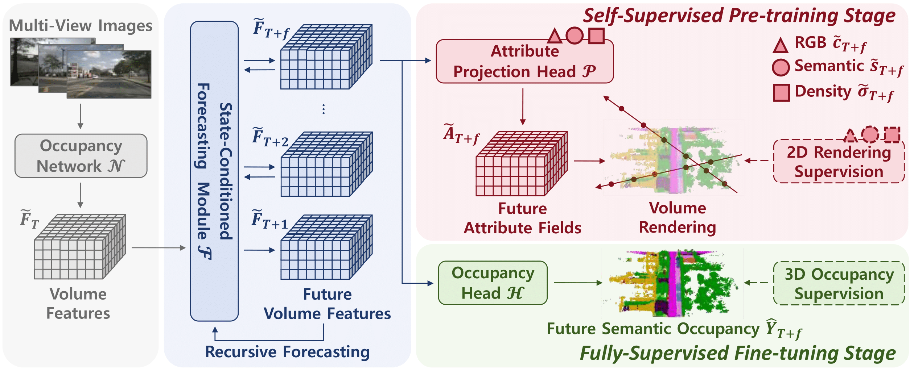

# PreWorld

> **Semi-Supervised Vision-Centric 3D Occupancy World Model for Autonomous Driving**  [[paper](https://arxiv.org/abs/2502.07309)]
>
> *ICLR 2025*


## TODO

- [x] Initial commit
- [x] Model zoo
- [x] arXiv version
- [ ] Code for nuPlan dataset (3D Occupancy Prediction)
- [ ] Code for LightWheelOcc dataset (3D Occupancy Prediction)


## Introduction

Understanding world dynamics is crucial for planning in autonomous driving. Recent methods attempt to achieve this by learning a 3D occupancy world model that forecasts future surrounding scenes based on current observation. However, 3D occupancy labels are still required to produce promising results. Considering the high annotation cost for 3D outdoor scenes, we propose a semi-supervised vision-centric 3D occupancy world model, **PreWorld**, to leverage the potential of 2D labels through a novel two-stage training paradigm: the self-supervised pre-training stage and the fully-supervised fine-tuning stage. Specifically, during the pre-training stage, we utilize an attribute projection head to generate different attribute fields of a scene (e.g., RGB, density, semantic), thus enabling temporal supervision from 2D labels via volume rendering techniques. Furthermore, we introduce a simple yet effective state-conditioned forecasting module to recursively forecast future occupancy and ego trajectory in a direct manner. Extensive experiments on the nuScenes dataset validate the effectiveness and scalability of our method, and demonstrate that PreWorld achieves competitive performance across 3D occupancy prediction, 4D occupancy forecasting and motion planning tasks.




## Getting Started

- [Installation](docs/install.md)

- [Prepare Dataset](docs/prepare_datasets.md)

- [Run and Eval](docs/getting_started.md)


## Model Zoo

#### 3D Occupancy Prediction (on Occ3D-nuScenes Benchmark)

|          Method           | mIoU  |                            Config                            | Checkpoints |
| :-----------------------: | :---: | :----------------------------------------------------------: | :---------: |
| PreWorld (+ Pre-training) | 34.69 | [config](configs/preworld/nuscenes/preworld-7frame-finetune.py) |    [model](https://huggingface.co/FortyTwoo/PreWorld/blob/main/preworld_nuscenes_3docc_stbase_pretrained.pth)    |

#### 4D Occupancy Forecasting (on Occ3D-nuScenes Benchmark)

|          Method           | Avg mIoU |                            Config                            | Checkpoints |
| :-----------------------: | :------: | :----------------------------------------------------------: | :---------: |
| PreWorld (+ Pre-training) |   9.55   | [config](configs/preworld/nuscenes-temporal/preworld-7frame-finetune-traj.py) |    [model](https://huggingface.co/FortyTwoo/PreWorld/blob/main/preworld_nuscenes_4docc_stbase_pretrained.pth)    |

Coming soon... 🏗️ 🚧 🔨

#### 3D Occupancy Prediction (on OpenScene Benchmark)

|          Method           | mIoU  |                            Config                            | Checkpoints |
| :-----------------------: | :---: | :----------------------------------------------------------: | :---------: |
| PreWorld (+ nuPlan Pre-training, 15000 scenes) | 19.85 | config |    model    |


## Acknowledgement

Many thanks to these excellent open source projects:

- [RenderOcc](https://github.com/pmj110119/RenderOcc)
- [Occ3D](https://github.com/Tsinghua-MARS-Lab/Occ3D)

- [OpenScene](https://github.com/OpenDriveLab/OpenScene)
- [LightWheelOcc](https://github.com/OpenDriveLab/LightwheelOcc)

- [OccWorld](https://github.com/wzzheng/OccWorld)
- [AD-MLP](https://github.com/E2E-AD/AD-MLP)


## Bibtex
If you find this work useful, please consider citing:

```
@article{li2025semi,
  title={Semi-Supervised Vision-Centric 3D Occupancy World Model for Autonomous Driving},
  author={Li, Xiang and Li, Pengfei and Zheng, Yupeng and Sun, Wei and Wang, Yan and Chen, Yilun},
  journal={arXiv preprint arXiv:2502.07309},
  year={2025}
}
```
